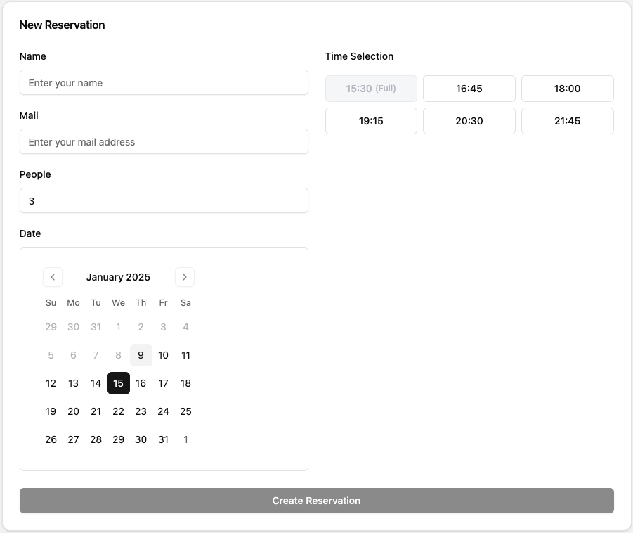

# Restaurant Microservices Project

## Overview
This project is a restaurant management system built using a microservices architecture.
The system allows users to handle restaurant reservations, menu management, subscription system and mail support.
The project uses the following technologies:

- **Backend**:
  - Golang and Echo for Reservation, Subscription and Mail Services
  - Django for Content Service
  - GRPC for connection between microservices
  - SQLC for database interaction in Go services
  - PostgreSQL and MySQL as the database
- **Frontend**:
  - React for building a responsive and interactive user interface
- **Reverse Proxy**:
  - Nginx for routing
- **Containerization**:
  - Docker for managing and deploying services


## Architecture

The project is designed as a set of microservices:
1. **API Gateway** (Nginx): Routes requests to appropriate services.
2. **Reservation Service** (Golang Echo): Manages reservations and sends grpc requests to mail-service for sending mail.
3. **Subscription Service** (Golang Echo): Takes subscription requests. The endpoint /send-mail is sends mail to subscribed ones.
4. **Mail Service** (Golang): Handling grpc requests, rendering html and sending mail. That's what actually mail service do. 
Also uses go packages like embed for better performance.
5. **User Management** (Django): Provides get methods for getting menu items and serves django admin panel on localhost:8080/content/admin.
6. **Frontend** (React): A single-page-application interacting with APIs.

## Prerequisites
Before running the project, ensure you have the following installed:
- Docker and Docker Compose
- Make

## Setup Instructions
Before run the project you have to fill mail service smtp settings in docker-compose.yml.


### Running the Project
Start all services using Docker Compose:
```bash
git clone https://github.com/serkanburul/restaurant-microservices.git
cd restaurant-microservices
make up_build
```

### Database Setup
There is a file named insert.sql in /reservation-service/db/insert. Program needs this insert's for working without any problems.
But this query is not executed when the program is run. So you have to run this queries your own.

## Pictures



